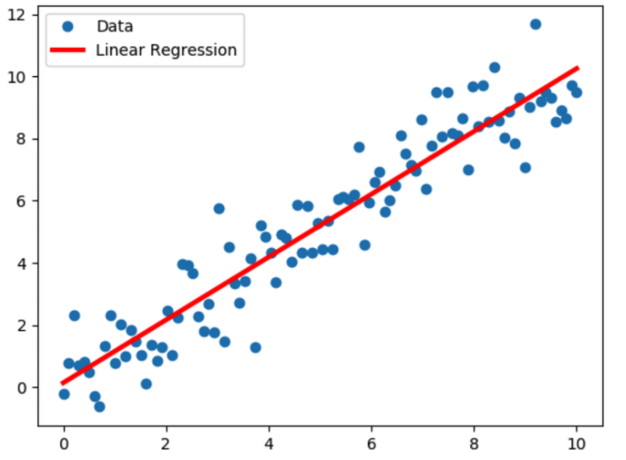

<div class="cell markdown">

# Car Price Prediction using Linear Regression

</div>

<div class="cell markdown">

This notebook will introduce some foundation machine learning and data
science concepts by exploring the problem of Car price prediction.

It is intended to be an end-to-end example of what a data science and
machine learning proof of concept might look like.

## 1\. Problem Definition¶

A Chinese automobile company Geely Auto aspires to enter the US market
by setting up their manufacturing unit there and producing cars locally
to give competition to their US and European counterparts.

They have contracted an automobile consulting company to understand the
factors on which the pricing of cars depends. Specifically, they want to
understand the factors affecting the pricing of cars in the American
market, since those may be very different from the Chinese market.

<b>The company wants to know:</b> Which variables are significant in
predicting the price of a car. How well those variables describe the
price of a car.

Based on various market surveys, the consulting firm has gathered a
large dataset of different types of cars across the Americal market.

### Brief about Linear Regression:

<b>Linear regression</b> is a supervised machine learning algorithm
where the predicted output is continuous and has a constant slope. It's
used to predict values within a continuous range, (e.g. sales, price).
The simplest form of the regression equation with one dependent and one
independent variable is defined by the formula y = c + b\*x, where y =
estimated dependent variable score, c = constant, b = regression
coefficient, and x = score on the independent variable.

There are two main types:

  - Simple regression

Simple linear regression uses traditional slope-intercept form, where m
and b are the variables our algorithm will try to “learn” to produce the
most accurate predictions. x represents our input data and y represents
our prediction.

y=mx+b

  - Multivariable regression

A more complex, multi-variable linear equation might look like this,
where w represents the coefficients, or weights, our model will try to
learn.

f(x,y,z)=w1x+w2y+w3z The variables x,y,z represent the attributes, or
distinct pieces of information, we have about each observation. For
sales predictions, these attributes might include a company’s
advertising spend on radio, TV, and newspapers.

Sales=w1Radio+w2TV+w3News

<b>Ideal Rregression model graphical representation for reference. Which
is our target to build a model like this -</b>


</div>

<div class="cell markdown">

## 2\. Data

we've downloaded it in a formatted way from Kaggle.

</div>

<div class="cell markdown">

## 3\. Goal

We are required to model the price of cars with the available
independent variables. It will be used by the management to understand
how exactly the prices vary with the independent variables. They can
accordingly manipulate the design of the cars, the business strategy
etc. to meet certain price levels. Further, the model will be a good way
for management to understand the pricing dynamics of a new market.

</div>

<div class="cell markdown">

## 4\. Reading and Understanding Data

</div>

<div class="cell code" data-execution_count="1">

``` python
# Importing all required packages
import numpy as np
import pandas as pd
import matplotlib.pyplot as plt
import seaborn as sns
%matplotlib inline
from matplotlib.pyplot import xticks
```

</div>

<div class="cell code" data-execution_count="2">

``` python
# supress warnings
import warnings
warnings.filterwarnings('ignore')
```

</div>

<div class="cell markdown">

### Data Loading from CSV File

</div>

<div class="cell code" data-execution_count="3">

``` python
df = pd.DataFrame(pd.read_csv("CarPrice_Assignment.csv"))
```

</div>

<div class="cell code" data-execution_count="4">

``` python
df.head()
```

<div class="output execute_result" data-execution_count="4">

``` 
   car_ID  symboling                   CarName fueltype aspiration doornumber  \
0       1          3        alfa-romero giulia      gas        std        two   
1       2          3       alfa-romero stelvio      gas        std        two   
2       3          1  alfa-romero Quadrifoglio      gas        std        two   
3       4          2               audi 100 ls      gas        std       four   
4       5          2                audi 100ls      gas        std       four   

       carbody drivewheel enginelocation  wheelbase  ...  enginesize  \
0  convertible        rwd          front       88.6  ...         130   
1  convertible        rwd          front       88.6  ...         130   
2    hatchback        rwd          front       94.5  ...         152   
3        sedan        fwd          front       99.8  ...         109   
4        sedan        4wd          front       99.4  ...         136   

   fuelsystem  boreratio  stroke compressionratio horsepower  peakrpm citympg  \
0        mpfi       3.47    2.68              9.0        111     5000      21   
1        mpfi       3.47    2.68              9.0        111     5000      21   
2        mpfi       2.68    3.47              9.0        154     5000      19   
3        mpfi       3.19    3.40             10.0        102     5500      24   
4        mpfi       3.19    3.40              8.0        115     5500      18   

   highwaympg    price  
0          27  13495.0  
1          27  16500.0  
2          26  16500.0  
3          30  13950.0  
4          22  17450.0  

[5 rows x 26 columns]
```

</div>

</div>

<div class="cell code" data-execution_count="96">

``` python
print(df.shape)
# Data has 26 columns and 205 rows.
```

<div class="output stream stdout">

    (205, 30)

</div>

</div>

<div class="cell code" data-execution_count="6">

``` python
df.describe()
```

<div class="output execute_result" data-execution_count="6">

``` 
           car_ID   symboling   wheelbase   carlength    carwidth   carheight  \
count  205.000000  205.000000  205.000000  205.000000  205.000000  205.000000   
mean   103.000000    0.834146   98.756585  174.049268   65.907805   53.724878   
std     59.322565    1.245307    6.021776   12.337289    2.145204    2.443522   
min      1.000000   -2.000000   86.600000  141.100000   60.300000   47.800000   
25%     52.000000    0.000000   94.500000  166.300000   64.100000   52.000000   
50%    103.000000    1.000000   97.000000  173.200000   65.500000   54.100000   
75%    154.000000    2.000000  102.400000  183.100000   66.900000   55.500000   
max    205.000000    3.000000  120.900000  208.100000   72.300000   59.800000   

        curbweight  enginesize   boreratio      stroke  compressionratio  \
count   205.000000  205.000000  205.000000  205.000000        205.000000   
mean   2555.565854  126.907317    3.329756    3.255415         10.142537   
std     520.680204   41.642693    0.270844    0.313597          3.972040   
min    1488.000000   61.000000    2.540000    2.070000          7.000000   
25%    2145.000000   97.000000    3.150000    3.110000          8.600000   
50%    2414.000000  120.000000    3.310000    3.290000          9.000000   
75%    2935.000000  141.000000    3.580000    3.410000          9.400000   
max    4066.000000  326.000000    3.940000    4.170000         23.000000   

       horsepower      peakrpm     citympg  highwaympg         price  
count  205.000000   205.000000  205.000000  205.000000    205.000000  
mean   104.117073  5125.121951   25.219512   30.751220  13276.710571  
std     39.544167   476.985643    6.542142    6.886443   7988.852332  
min     48.000000  4150.000000   13.000000   16.000000   5118.000000  
25%     70.000000  4800.000000   19.000000   25.000000   7788.000000  
50%     95.000000  5200.000000   24.000000   30.000000  10295.000000  
75%    116.000000  5500.000000   30.000000   34.000000  16503.000000  
max    288.000000  6600.000000   49.000000   54.000000  45400.000000  
```

</div>

</div>

<div class="cell code" data-execution_count="7">

``` python
df.columns
```

<div class="output execute_result" data-execution_count="7">

    Index(['car_ID', 'symboling', 'CarName', 'fueltype', 'aspiration',
           'doornumber', 'carbody', 'drivewheel', 'enginelocation', 'wheelbase',
           'carlength', 'carwidth', 'carheight', 'curbweight', 'enginetype',
           'cylindernumber', 'enginesize', 'fuelsystem', 'boreratio', 'stroke',
           'compressionratio', 'horsepower', 'peakrpm', 'citympg', 'highwaympg',
           'price'],
          dtype='object')

</div>

</div>

<div class="cell code" data-execution_count="8">

``` python
df.info()
```

<div class="output stream stdout">

    <class 'pandas.core.frame.DataFrame'>
    RangeIndex: 205 entries, 0 to 204
    Data columns (total 26 columns):
     #   Column            Non-Null Count  Dtype  
    ---  ------            --------------  -----  
     0   car_ID            205 non-null    int64  
     1   symboling         205 non-null    int64  
     2   CarName           205 non-null    object 
     3   fueltype          205 non-null    object 
     4   aspiration        205 non-null    object 
     5   doornumber        205 non-null    object 
     6   carbody           205 non-null    object 
     7   drivewheel        205 non-null    object 
     8   enginelocation    205 non-null    object 
     9   wheelbase         205 non-null    float64
     10  carlength         205 non-null    float64
     11  carwidth          205 non-null    float64
     12  carheight         205 non-null    float64
     13  curbweight        205 non-null    int64  
     14  enginetype        205 non-null    object 
     15  cylindernumber    205 non-null    object 
     16  enginesize        205 non-null    int64  
     17  fuelsystem        205 non-null    object 
     18  boreratio         205 non-null    float64
     19  stroke            205 non-null    float64
     20  compressionratio  205 non-null    float64
     21  horsepower        205 non-null    int64  
     22  peakrpm           205 non-null    int64  
     23  citympg           205 non-null    int64  
     24  highwaympg        205 non-null    int64  
     25  price             205 non-null    float64
    dtypes: float64(8), int64(8), object(10)
    memory usage: 41.8+ KB

</div>

</div>

<div class="cell markdown">

### Data Cleaning

</div>

<div class="cell code" data-execution_count="9">

``` python
df.isnull().sum()
```

<div class="output execute_result" data-execution_count="9">

    car_ID              0
    symboling           0
    CarName             0
    fueltype            0
    aspiration          0
    doornumber          0
    carbody             0
    drivewheel          0
    enginelocation      0
    wheelbase           0
    carlength           0
    carwidth            0
    carheight           0
    curbweight          0
    enginetype          0
    cylindernumber      0
    enginesize          0
    fuelsystem          0
    boreratio           0
    stroke              0
    compressionratio    0
    horsepower          0
    peakrpm             0
    citympg             0
    highwaympg          0
    price               0
    dtype: int64

</div>

</div>

<div class="cell code" data-execution_count="10">

``` python
df.isnull().sum().sum()
```

<div class="output execute_result" data-execution_count="10">

``` 
0
```

</div>

</div>

<div class="cell code" data-execution_count="11">

``` python
# Checking dataset contain any duplicate value

sum(df.duplicated(subset = 'car_ID')) == 0

# True meaning - No duplicate values
```

<div class="output execute_result" data-execution_count="11">

    True

</div>

</div>

<div class="cell markdown">

# Exploratory Data Analysis ( EDA )

## Univariate Analysis

### Price : Target Variable

</div>

<div class="cell code" data-execution_count="12">

``` python
df.price.describe()
```

<div class="output execute_result" data-execution_count="12">

    count      205.000000
    mean     13276.710571
    std       7988.852332
    min       5118.000000
    25%       7788.000000
    50%      10295.000000
    75%      16503.000000
    max      45400.000000
    Name: price, dtype: float64

</div>

</div>

<div class="cell code" data-execution_count="13">

``` python
sns.distplot(df['price'])
```

<div class="output execute_result" data-execution_count="13">

    <AxesSubplot:xlabel='price', ylabel='Density'>

</div>

<div class="output display_data">


</div>

</div>

<div class="cell markdown">

  - Mean and median of price are significantly different.
  - Large standard deviation indicates that there is considerable
    variance in the prices of the automobiles.
  - Price values are right-skewed, most cars are priced at the lower end
    (9000) of the price range.

</div>

<div class="cell markdown">

### Car ID

car\_ID : Unique ID for each observation

</div>

<div class="cell markdown">

### Symboling

Its assigned insurance risk rating -

  - value of +3 indicates that the auto is risky,
  - \-3 that it is probably pretty safe.(Categorical)

</div>

<div class="cell code" data-execution_count="14">

``` python
# Let's see the count of automobile in each category and percent share of each category.

plt1 = sns.countplot(df['symboling'])
plt1.set(xlabel = 'Symbol', ylabel= 'Count of Cars')
plt.show()
plt.tight_layout()
```

<div class="output display_data">


</div>

<div class="output display_data">

    <Figure size 432x288 with 0 Axes>

</div>

</div>

<div class="cell code" data-execution_count="15">

``` python
df_sym = pd.DataFrame(df['symboling'].value_counts())
df_sym.plot.pie(subplots=True,labels = df_sym.index.values, autopct='%1.1f%%', figsize = (15,7.5))

# Unsquish the pie.
plt.gca().set_aspect('equal')
plt.show()
plt.tight_layout()
```

<div class="output display_data">


</div>

<div class="output display_data">

    <Figure size 432x288 with 0 Axes>

</div>

</div>

<div class="cell code" data-execution_count="16">

``` python
# Let's find the average price of cars in each symbol category.

plt1 = df[['symboling','price']].groupby("symboling").mean().plot(kind='bar',legend = False,color='royalblue')
plt1.set_xlabel("Symbol")
plt1.set_ylabel("Avg Price (Dollars)")
xticks(rotation = 0)
plt.show()
```

<div class="output display_data">


</div>

</div>

<div class="cell markdown">

### Car Name

</div>

<div class="cell code" data-execution_count="17">

``` python
# To check the format of the Car name we display 1st 25 list of car

df.CarName.values[0:24]
```

<div class="output execute_result" data-execution_count="17">

    array(['alfa-romero giulia', 'alfa-romero stelvio',
           'alfa-romero Quadrifoglio', 'audi 100 ls', 'audi 100ls',
           'audi fox', 'audi 100ls', 'audi 5000', 'audi 4000',
           'audi 5000s (diesel)', 'bmw 320i', 'bmw 320i', 'bmw x1', 'bmw x3',
           'bmw z4', 'bmw x4', 'bmw x5', 'bmw x3', 'chevrolet impala',
           'chevrolet monte carlo', 'chevrolet vega 2300', 'dodge rampage',
           'dodge challenger se', 'dodge d200'], dtype=object)

</div>

</div>

<div class="cell markdown">

It is observed that Car Name consists of two parts <b>'car company' + '
' + 'Car Model'</b> Let's split out car company to a new column.

</div>

<div class="cell code" data-execution_count="18">

``` python
df['brand'] = df.CarName.str.split(' ').str.get(0).str.upper()
```

</div>

<div class="cell code" data-execution_count="19">

``` python
len(set(df.brand.values))
```

<div class="output execute_result" data-execution_count="19">

``` 
27
```

</div>

</div>

<div class="cell code" data-execution_count="20">

``` python
# Let's see companies and their no of models.

fig, ax = plt.subplots(figsize = (15,5))
plt1 = sns.countplot(df['brand'], order=pd.value_counts(df['brand']).index,)
plt1.set(xlabel = 'Brand', ylabel= 'Count of Cars')
xticks(rotation = 90)
plt.show()
plt.tight_layout()
```

<div class="output display_data">


</div>

<div class="output display_data">

    <Figure size 432x288 with 0 Axes>

</div>

</div>

<div class="cell code" data-execution_count="21">

``` python
# It's noticed that in brand names,
# VOLKSWAGON has three different values as VOLKSWAGEN, VOKSWAGEN and VW
# MAZDA is also spelled as MAXDA
# PORSCHE as PORSCHE and PORCSCHE.
# Let's fix these data issues.


df['brand'] = df['brand'].replace(['VW', 'VOKSWAGEN'], 'VOLKSWAGEN')
df['brand'] = df['brand'].replace(['MAXDA'], 'MAZDA')
df['brand'] = df['brand'].replace(['PORCSHCE'], 'PORSCHE')
df['brand'] = df['brand'].replace(['TOYOUTA'], 'TOYOTA')
```

</div>

<div class="cell code" data-execution_count="22">

``` python
fig, ax = plt.subplots(figsize = (15,5))
plt1 = sns.countplot(df['brand'], order=pd.value_counts(df['brand']).index,)
plt1.set(xlabel = 'Brand', ylabel= 'Count of Cars')
xticks(rotation = 90)
plt.show()
plt.tight_layout()
```

<div class="output display_data">


</div>

<div class="output display_data">

    <Figure size 432x288 with 0 Axes>

</div>

</div>

<div class="cell code" data-execution_count="23">

``` python
df.brand.describe()
```

<div class="output execute_result" data-execution_count="23">

    count        205
    unique        22
    top       TOYOTA
    freq          32
    Name: brand, dtype: object

</div>

</div>

<div class="cell markdown">

Toyota, a Japanese company has the most no of models.

</div>

<div class="cell code" data-execution_count="24">

``` python
# Let's see average car price of each company.

df_comp_avg_price = df[['brand','price']].groupby("brand", as_index = False).mean().rename(columns={'price':'brand_avg_price'})
plt1 = df_comp_avg_price.plot(x = 'brand', kind='bar',legend = False, sort_columns = True, figsize = (15,3))
plt1.set_xlabel("Brand")
plt1.set_ylabel("Avg Price (Dollars)")
xticks(rotation = 90)
plt.show()
```

<div class="output display_data">


</div>

</div>

<div class="cell code" data-execution_count="25">

``` python
#df_comp_avg_price

df = df.merge(df_comp_avg_price, on = 'brand')
```

</div>

<div class="cell code" data-execution_count="26">

``` python
df['brand_category'] = df['brand_avg_price'].apply(lambda x : "Budget" if x < 10000 
                                                     else ("Mid_Range" if 10000 <= x < 20000
                                                           else "Luxury"))
```

</div>

<div class="cell markdown">

Toyota has considerably high no of models in the market. Brands can be
categorised as Luxury, Mid Ranged, Budget based on their average price.
Some of the Luxury brans are

</div>

<div class="cell markdown">

### Fuel Type

</div>

<div class="cell code" data-execution_count="27">

``` python
df.fueltype.value_counts()
```

<div class="output execute_result" data-execution_count="27">

    gas       185
    diesel     20
    Name: fueltype, dtype: int64

</div>

</div>

<div class="cell code" data-execution_count="28">

``` python
# Let's see how price varies with  Fuel Type

df_fuel_avg_price = df[['fueltype','price']].groupby("fueltype", as_index = False).mean().rename(columns={'price':'fuel_avg_price'})
plt1 = df_fuel_avg_price.plot(x = 'fueltype', kind='bar',legend = False, sort_columns = True, color = "teal")
plt1.set_xlabel("Fuel Type")
plt1.set_ylabel("Avg Price (Dollars)")
xticks(rotation = 0)
plt.show()
```

<div class="output display_data">


</div>

</div>

<div class="cell markdown">

<b>Diesel cars are priced more than gas cars.</b>

</div>

<div class="cell markdown">

### Aspiration

</div>

<div class="cell code" data-execution_count="29">

``` python
df.aspiration.value_counts()
```

<div class="output execute_result" data-execution_count="29">

    std      168
    turbo     37
    Name: aspiration, dtype: int64

</div>

</div>

<div class="cell code" data-execution_count="30">

``` python
df_aspir_avg_price = df[['aspiration','price']].groupby("aspiration", as_index = False).mean().rename(columns={'price':'aspir_avg_price'})
plt1 = df_aspir_avg_price.plot(x = 'aspiration', kind='bar',legend = False, sort_columns = True, color = "indigo")
plt1.set_xlabel("Aspiration")
plt1.set_ylabel("Avg Price (Dollars)")
xticks(rotation = 0)
plt.show()
```

<div class="output display_data">


</div>

</div>

<div class="cell markdown">

<b>Cars with turbo aspiration engine are priced more than standard ones.

</div>

<div class="cell markdown">

### Door Numbers

</div>

<div class="cell code" data-execution_count="31">

``` python
df.doornumber.value_counts()
```

<div class="output execute_result" data-execution_count="31">

    four    115
    two      90
    Name: doornumber, dtype: int64

</div>

</div>

<div class="cell code" data-execution_count="32">

``` python
df_door_avg_price = df[['doornumber','price']].groupby("doornumber", as_index = False).mean().rename(columns={'price':'door_avg_price'})
plt1 = df_door_avg_price.plot(x = 'doornumber', kind='bar',legend = False, sort_columns = True , color = "grey")
plt1.set_xlabel("No of Doors")
plt1.set_ylabel("Avg Price (Dollars)")
xticks(rotation = 0)
plt.show()
```

<div class="output display_data">


</div>

</div>

<div class="cell markdown">

<b>Number of doors doesn't seem to have much effect on price.

</div>

<div class="cell markdown">

### Car Body

</div>

<div class="cell code" data-execution_count="33">

``` python
df.carbody.value_counts()
```

<div class="output execute_result" data-execution_count="33">

    sedan          96
    hatchback      70
    wagon          25
    hardtop         8
    convertible     6
    Name: carbody, dtype: int64

</div>

</div>

<div class="cell code" data-execution_count="34">

``` python
df_body_avg_price = df[['carbody','price']].groupby("carbody", as_index = False).mean().rename(columns={'price':'carbody_avg_price'})
plt1 = df_body_avg_price.plot(x = 'carbody', kind='bar',legend = False, sort_columns = True, color = 'darkgoldenrod')
plt1.set_xlabel("Car Body")
plt1.set_ylabel("Avg Price (Dollars)")
xticks(rotation = 0)
plt.show() 
```

<div class="output display_data">


</div>

</div>

<div class="cell markdown">

<b>Hardtop and convertible are the most expensive whereas hatchbacks are
the cheapest.

</div>

<div class="cell markdown">

### Wheel base

</div>

<div class="cell code" data-execution_count="35">

``` python
len(df.wheelbase.value_counts())
```

<div class="output execute_result" data-execution_count="35">

``` 
53
```

</div>

</div>

<div class="cell code" data-execution_count="36">

``` python
plt1 = sns.scatterplot(x = 'wheelbase', y = 'price', data = df, color = 'darkmagenta')
plt1.set_xlabel('Wheelbase (Inches)')
plt1.set_ylabel('Price of Car (Dollars)')
plt.show()
```

<div class="output display_data">


</div>

</div>

<div class="cell code" data-execution_count="95">

``` python
sns.regplot(y=df['price'], x=df['wheelbase'])
```

<div class="output execute_result" data-execution_count="95">

    <AxesSubplot:xlabel='wheelbase', ylabel='price'>

</div>

<div class="output display_data">


</div>

</div>

<div class="cell markdown">

  - Most cars has a wheel base around 95 inches.
  - Price has a slight positive correlation with wheelbase.

</div>

<div class="cell markdown">

### Car Dimensions

</div>

<div class="cell code" data-execution_count="37">

``` python
# Let's see how price varies with Car's length, width,height and weight.

fig, axs = plt.subplots(2,2,figsize=(15,10))
plt1 = sns.scatterplot(x = 'carlength', y = 'price', data = df, ax = axs[0,0], color='b')
plt1.set_xlabel('Length of Car (Inches)')
plt1.set_ylabel('Price of Car (Dollars)')
plt2 = sns.scatterplot(x = 'carwidth', y = 'price', data = df, ax = axs[0,1], color='b')
plt2.set_xlabel('Width of Car (Inches)')
plt2.set_ylabel('Price of Car (Dollars)')
plt3 = sns.scatterplot(x = 'carheight', y = 'price', data = df, ax = axs[1,0], color='b')
plt3.set_xlabel('Height of Car (Inches)')
plt3.set_ylabel('Price of Car (Dollars)')
plt3 = sns.scatterplot(x = 'curbweight', y = 'price', data = df, ax = axs[1,1], color='b')
plt3.set_xlabel('Weight of Car (Pounds)')
plt3.set_ylabel('Price of Car (Dollars)')
plt.tight_layout()
```

<div class="output display_data">


</div>

</div>

<div class="cell markdown">

### Engine Specifications

</div>

<div class="cell code" data-execution_count="38">

``` python
df.enginetype.value_counts()
```

<div class="output execute_result" data-execution_count="38">

    ohc      148
    ohcf      15
    ohcv      13
    dohc      12
    l         12
    rotor      4
    dohcv      1
    Name: enginetype, dtype: int64

</div>

</div>

<div class="cell code" data-execution_count="39">

``` python
df.cylindernumber.value_counts()
```

<div class="output execute_result" data-execution_count="39">

    four      159
    six        24
    five       11
    eight       5
    two         4
    three       1
    twelve      1
    Name: cylindernumber, dtype: int64

</div>

</div>

<div class="cell code" data-execution_count="40">

``` python
df.fuelsystem.value_counts()
```

<div class="output execute_result" data-execution_count="40">

    mpfi    94
    2bbl    66
    idi     20
    1bbl    11
    spdi     9
    4bbl     3
    mfi      1
    spfi     1
    Name: fuelsystem, dtype: int64

</div>

</div>

<div class="cell code" data-execution_count="41">

``` python
# Now plot in the graphical format all 3

fig, axs = plt.subplots(1,3,figsize=(20,5))

#Engine Type
df_engine_avg_price = df[['enginetype','price']].groupby("enginetype", as_index = False).mean().rename(columns={'price':'engine_avg_price'})
plt1 = df_engine_avg_price.plot(x = 'enginetype', kind='bar', sort_columns = True, legend = False, ax = axs[0],color = 'deepskyblue')
plt1.set_xlabel("Engine Type")
plt1.set_ylabel("Avg Price (Dollars)")
xticks(rotation = 0)

#Cylinder Number
df_cylindernumber_avg_price = df[['cylindernumber','price']].groupby("cylindernumber", as_index = False).mean().rename(columns={'price':'cylindernumber_avg_price'})
plt1 = df_cylindernumber_avg_price.plot(x = 'cylindernumber', kind='bar', sort_columns = True,legend = False, ax = axs[1],color = 'deepskyblue')
plt1.set_xlabel("Cylinder Number")
plt1.set_ylabel("Avg Price (Dollars)")
xticks(rotation = 0)

#Fuel System
df_fuelsystem_avg_price = df[['fuelsystem','price']].groupby("fuelsystem", as_index = False).mean().rename(columns={'price':'fuelsystem_avg_price'})
plt1 = df_fuelsystem_avg_price.plot(x = 'fuelsystem', kind='bar', sort_columns = True,legend = False, ax = axs[2],color = 'deepskyblue')
plt1.set_xlabel("Fuel System")
plt1.set_ylabel("Avg Price (Dollars)")
xticks(rotation = 0)
plt.show()
```

<div class="output display_data">


</div>

</div>

<div class="cell markdown">

  - DOHCV and OHCV engine types are priced high.
  - Eight and twelve cylinder cars have higher price.
  - IDI and MPFI fuel system have higher price.

</div>

<div class="cell markdown">

### Engine Size, Bore Ratio, Stroke, Horsepower,Peak RPM & Compression Ratio

</div>

<div class="cell code" data-execution_count="42">

``` python
fig, axs = plt.subplots(3,2,figsize=(20,20))

#Engine Size
plt1 = sns.scatterplot(x = 'enginesize', y = 'price', data = df, ax = axs[0,0], color='red')
plt1.set_xlabel('Size of Engine (Cubic Inches)')
plt1.set_ylabel('Price of Car (Dollars)')

#Bore Ratio
plt2 = sns.scatterplot(x = 'boreratio', y = 'price', data = df, ax = axs[0,1],color='red')
plt2.set_xlabel('Bore Ratio')
plt2.set_ylabel('Price of Car (Dollars)')

#Stroke
plt3 = sns.scatterplot(x = 'stroke', y = 'price', data = df, ax = axs[1,0],color='red')
plt3.set_xlabel('Stroke')
plt3.set_ylabel('Price of Car (Dollars)')

#Compression Ratio
plt4 = sns.scatterplot(x = 'compressionratio', y = 'price', data = df, ax = axs[1,1],color='red')
plt4.set_xlabel('Compression Ratio')
plt4.set_ylabel('Price of Car (Dollars)')

#Horsepower
plt5 = sns.scatterplot(x = 'horsepower', y = 'price', data = df, ax = axs[2,0],color='red')
plt5.set_xlabel('Horsepower')
plt5.set_ylabel('Price of Car (Dollars)')

#Peak RPM
plt5 = sns.scatterplot(x = 'peakrpm', y = 'price', data = df, ax = axs[2,1],color='red')
plt5.set_xlabel('Peak RPM')
plt5.set_ylabel('Price of Car (Dollars)')
plt.tight_layout()
plt.show()
```

<div class="output display_data">


</div>

</div>

<div class="cell markdown">

<b>Size of Engine, bore ratio, and Horsepower has positive correlation
with price.

</div>

<div class="cell code" data-execution_count="43">

``` python
# A single variable mileage can be calculated taking the weighted average of 55% city and 45% highways.

df['mileage'] = df['citympg']*0.55 + df['highwaympg']*0.45
```

</div>

<div class="cell code" data-execution_count="44">

``` python
# Let's see how price varies with mileage.

plt1 = sns.scatterplot(x = 'mileage', y = 'price', data = df, color = 'blue')
plt1.set_xlabel('Mileage')
plt1.set_ylabel('Price of Car (Dollars)')
plt.show()
```

<div class="output display_data">


</div>

</div>

<div class="cell markdown">

<b>Mileage has a negative correlation with price.

</div>

<div class="cell markdown">

## Bivariate Analysis

</div>

<div class="cell markdown">

### Brand Category - Mileage

</div>

<div class="cell code" data-execution_count="45">

``` python
df.brand_category.value_counts()
```

<div class="output execute_result" data-execution_count="45">

    Budget       95
    Mid_Range    86
    Luxury       24
    Name: brand_category, dtype: int64

</div>

</div>

<div class="cell code" data-execution_count="46">

``` python
plt1 = sns.scatterplot(x = 'mileage', y = 'price', hue = 'brand_category', data = df)
plt1.set_xlabel('Mileage')
plt1.set_ylabel('Price of Car (Dollars)')
plt.show()
```

<div class="output display_data">


</div>

</div>

<div class="cell markdown">

<b>It is expected that luxury brands don't care about mileage. Let's
find out how price varies with brand category and mileage.

</div>

<div class="cell markdown">

### Brand Category - Horsepower

</div>

<div class="cell code" data-execution_count="47">

``` python
plt1 = sns.scatterplot(x = 'horsepower', y = 'price', hue = 'brand_category', data = df)
plt1.set_xlabel('Horsepower')
plt1.set_ylabel('Price of Car (Dollars)')
plt.show()
```

<div class="output display_data">


</div>

</div>

<div class="cell code" data-execution_count="93">

``` python
sns.regplot(y=df['price'], x=df['horsepower'])
```

<div class="output execute_result" data-execution_count="93">

    <AxesSubplot:xlabel='horsepower', ylabel='price'>

</div>

<div class="output display_data">


</div>

</div>

<div class="cell markdown">

### Mileage - Fuel Type

</div>

<div class="cell code" data-execution_count="48">

``` python
plt1 = sns.scatterplot(x = 'mileage', y = 'price', hue = 'fueltype', data = df)
plt1.set_xlabel('Mileage')
plt1.set_ylabel('Price of Car (Dollars)')
plt.show()
```

<div class="output display_data">


</div>

</div>

<div class="cell markdown">

### Horsepower - Fuel Type

</div>

<div class="cell code" data-execution_count="49">

``` python
plt1 = sns.scatterplot(x = 'horsepower', y = 'price', hue = 'fueltype', data = df)
plt1.set_xlabel('Horsepower')
plt1.set_ylabel('Price of Car (Dollars)')
plt.show()
```

<div class="output display_data">


</div>

</div>

<div class="cell markdown">

### Summary Univariate and Bivriate Analysis:

From the above Univariate and bivariate analysis we can filter out
variables which does not affect price much. The most important driver
variable for prediction of price are:-

  - Brand Category
  - Fuel Type
  - Aspiration
  - Car Body
  - Drive Wheel
  - Wheelbase
  - Car Length
  - Car Width
  - Curb weight
  - Engine Type
  - Cylinder Number
  - Engine Size
  - Bore Ratio
  - Horsepower
  - Mileage

</div>

<div class="cell markdown">

## 4\. Modelling - Linear Regression Model

</div>

<div class="cell code" data-execution_count="50">

``` python
auto = df[['fueltype', 'aspiration', 'carbody', 'drivewheel', 'wheelbase', 'carlength', 'carwidth', 'curbweight', 'enginetype',
       'cylindernumber', 'enginesize',  'boreratio', 'horsepower', 'price', 'brand_category', 'mileage']]
```

</div>

<div class="cell code" data-execution_count="51">

``` python
auto.head()
```

<div class="output execute_result" data-execution_count="51">

``` 
  fueltype aspiration      carbody drivewheel  wheelbase  carlength  carwidth  \
0      gas        std  convertible        rwd       88.6      168.8      64.1   
1      gas        std  convertible        rwd       88.6      168.8      64.1   
2      gas        std    hatchback        rwd       94.5      171.2      65.5   
3      gas        std        sedan        fwd       99.8      176.6      66.2   
4      gas        std        sedan        4wd       99.4      176.6      66.4   

   curbweight enginetype cylindernumber  enginesize  boreratio  horsepower  \
0        2548       dohc           four         130       3.47         111   
1        2548       dohc           four         130       3.47         111   
2        2823       ohcv            six         152       2.68         154   
3        2337        ohc           four         109       3.19         102   
4        2824        ohc           five         136       3.19         115   

     price brand_category  mileage  
0  13495.0      Mid_Range    23.70  
1  16500.0      Mid_Range    23.70  
2  16500.0      Mid_Range    22.15  
3  13950.0      Mid_Range    26.70  
4  17450.0      Mid_Range    19.80  
```

</div>

</div>

<div class="cell markdown">

### Visualising Numeric Variables

</div>

<div class="cell code" data-execution_count="52">

``` python
#Let's make a pairplot of all the numeric variables

plt.figure(figsize=(15, 15))
sns.pairplot(auto)
plt.show()
```

<div class="output display_data">

    <Figure size 1080x1080 with 0 Axes>

</div>

<div class="output display_data">


</div>

</div>

<div class="cell markdown">

### Visualising Categorical Variables

</div>

<div class="cell code" data-execution_count="53">

``` python
#Let's make a boxplot for categorical variables.

plt.figure(figsize=(10, 20))
plt.subplot(4,2,1)
sns.boxplot(x = 'fueltype', y = 'price', data = auto)
plt.subplot(4,2,2)
sns.boxplot(x = 'aspiration', y = 'price', data = auto)
plt.subplot(4,2,3)
sns.boxplot(x = 'carbody', y = 'price', data = auto)
plt.subplot(4,2,4)
sns.boxplot(x = 'drivewheel', y = 'price', data = auto)
plt.subplot(4,2,5)
sns.boxplot(x = 'enginetype', y = 'price', data = auto)
plt.subplot(4,2,6)
sns.boxplot(x = 'brand_category', y = 'price', data = auto)
plt.subplot(4,2,7)
sns.boxplot(x = 'cylindernumber', y = 'price', data = auto)
plt.tight_layout()
plt.show()
```

<div class="output display_data">


</div>

</div>

<div class="cell markdown">

## Data Preparation

</div>

<div class="cell code" data-execution_count="54">

``` python
#Categorical Variables are converted into Neumerical Variables with the help of Dummy Variable 

cyl_no = pd.get_dummies(auto['cylindernumber'], drop_first = True)
auto = pd.concat([auto, cyl_no], axis = 1)

brand_cat = pd.get_dummies(auto['brand_category'], drop_first = True)
auto = pd.concat([auto, brand_cat], axis = 1)

eng_typ = pd.get_dummies(auto['enginetype'], drop_first = True)
auto = pd.concat([auto, eng_typ], axis = 1)

drwh = pd.get_dummies(auto['drivewheel'], drop_first = True)
auto = pd.concat([auto, drwh], axis = 1)

carb = pd.get_dummies(auto['carbody'], drop_first = True)
auto = pd.concat([auto, carb], axis = 1)

asp = pd.get_dummies(auto['aspiration'], drop_first = True)
auto = pd.concat([auto, asp], axis = 1)

fuelt = pd.get_dummies(auto['fueltype'], drop_first = True)
auto = pd.concat([auto, fuelt], axis = 1)
```

</div>

<div class="cell code" data-execution_count="55">

``` python
auto.drop(['fueltype', 'aspiration', 'carbody', 'drivewheel', 'enginetype', 'cylindernumber','brand_category'], axis = 1, inplace = True)
```

</div>

<div class="cell markdown">

## Model Building

### Splitting the Data into Training and Testing sets

</div>

<div class="cell code" data-execution_count="56">

``` python
from sklearn.model_selection import train_test_split

# We specify this so that the train and test data set always have the same rows, respectively
np.random.seed(0)
df_train, df_test = train_test_split(auto, train_size = 0.7, test_size = 0.3, random_state = 100)
```

</div>

<div class="cell markdown">

### Rescaling the Features

</div>

<div class="cell code" data-execution_count="57">

``` python
# We will use min-max scaling

from sklearn.preprocessing import MinMaxScaler
scaler = MinMaxScaler()
```

</div>

<div class="cell code" data-execution_count="58">

``` python
# Apply scaler() to all the columns except the 'dummy' variables

num_vars = ['wheelbase', 'carlength', 'carwidth', 'curbweight', 'enginesize','boreratio', 'horsepower', 'price','mileage']
df_train[num_vars] = scaler.fit_transform(df_train[num_vars])
```

</div>

<div class="cell code" data-execution_count="59">

``` python
df_train.head()
```

<div class="output execute_result" data-execution_count="59">

``` 
     wheelbase  carlength  carwidth  curbweight  enginesize  boreratio  \
122   0.244828   0.426016  0.291667    0.272692    0.139623   0.230159   
125   0.272414   0.452033  0.666667    0.500388    0.339623   1.000000   
166   0.272414   0.448780  0.308333    0.314973    0.139623   0.444444   
1     0.068966   0.450407  0.316667    0.411171    0.260377   0.626984   
199   0.610345   0.775610  0.575000    0.647401    0.260377   0.746032   

     horsepower     price   mileage  five  ...  ohcv  rotor  fwd  rwd  \
122    0.083333  0.068818  0.530864     0  ...     0      0    1    0   
125    0.395833  0.466890  0.213992     0  ...     0      0    0    1   
166    0.266667  0.122110  0.344307     0  ...     0      0    0    1   
1      0.262500  0.314446  0.244170     0  ...     0      0    0    1   
199    0.475000  0.382131  0.122085     0  ...     0      0    0    1   

     hardtop  hatchback  sedan  wagon  turbo  gas  
122        0          0      1      0      0    1  
125        0          1      0      0      0    1  
166        0          1      0      0      0    1  
1          0          0      0      0      0    1  
199        0          0      0      1      1    1  

[5 rows x 31 columns]
```

</div>

</div>

<div class="cell code" data-execution_count="60">

``` python
df_train.describe()
```

<div class="output execute_result" data-execution_count="60">

``` 
        wheelbase   carlength    carwidth  curbweight  enginesize   boreratio  \
count  143.000000  143.000000  143.000000  143.000000  143.000000  143.000000   
mean     0.411141    0.525476    0.461655    0.407878    0.241351    0.497946   
std      0.205581    0.204848    0.184517    0.211269    0.154619    0.207140   
min      0.000000    0.000000    0.000000    0.000000    0.000000    0.000000   
25%      0.272414    0.399187    0.304167    0.245539    0.135849    0.305556   
50%      0.341379    0.502439    0.425000    0.355702    0.184906    0.500000   
75%      0.503448    0.669919    0.550000    0.559542    0.301887    0.682540   
max      1.000000    1.000000    1.000000    1.000000    1.000000    1.000000   

       horsepower       price     mileage        five  ...        ohcv  \
count  143.000000  143.000000  143.000000  143.000000  ...  143.000000   
mean     0.227302    0.219310    0.358265    0.062937  ...    0.062937   
std      0.165511    0.215682    0.185980    0.243703  ...    0.243703   
min      0.000000    0.000000    0.000000    0.000000  ...    0.000000   
25%      0.091667    0.067298    0.198903    0.000000  ...    0.000000   
50%      0.191667    0.140343    0.344307    0.000000  ...    0.000000   
75%      0.283333    0.313479    0.512346    0.000000  ...    0.000000   
max      1.000000    1.000000    1.000000    1.000000  ...    1.000000   

            rotor         fwd         rwd     hardtop   hatchback       sedan  \
count  143.000000  143.000000  143.000000  143.000000  143.000000  143.000000   
mean     0.027972    0.594406    0.349650    0.020979    0.342657    0.475524   
std      0.165472    0.492733    0.478536    0.143818    0.476266    0.501156   
min      0.000000    0.000000    0.000000    0.000000    0.000000    0.000000   
25%      0.000000    0.000000    0.000000    0.000000    0.000000    0.000000   
50%      0.000000    1.000000    0.000000    0.000000    0.000000    0.000000   
75%      0.000000    1.000000    1.000000    0.000000    1.000000    1.000000   
max      1.000000    1.000000    1.000000    1.000000    1.000000    1.000000   

            wagon       turbo         gas  
count  143.000000  143.000000  143.000000  
mean     0.132867    0.181818    0.909091  
std      0.340624    0.387050    0.288490  
min      0.000000    0.000000    0.000000  
25%      0.000000    0.000000    1.000000  
50%      0.000000    0.000000    1.000000  
75%      0.000000    0.000000    1.000000  
max      1.000000    1.000000    1.000000  

[8 rows x 31 columns]
```

</div>

</div>

<div class="cell code" data-execution_count="61">

``` python
# Let's check the correlation coefficients to see which variables are highly correlated

plt.figure(figsize = (40, 30))
sns.heatmap(df_train.corr(), annot = True, cmap="YlGnBu")
plt.show()
```

<div class="output display_data">


</div>

</div>

<div class="cell markdown">

### Dividing into X and Y sets for the model building

</div>

<div class="cell code" data-execution_count="62">

``` python
y_train = df_train.pop('price')
X_train = df_train
```

</div>

<div class="cell markdown">

#### RFE (Recursive feature elimination)

</div>

<div class="cell code" data-execution_count="63">

``` python
# Importing RFE and LinearRegression
from sklearn.feature_selection import RFE
from sklearn.linear_model import LinearRegression
```

</div>

<div class="cell code" data-execution_count="64">

``` python
# Running RFE with the output number of the variable equal to 10
lm = LinearRegression()
lm.fit(X_train, y_train)

rfe = RFE(lm, 10)   # running RFE
rfe = rfe.fit(X_train, y_train)
```

</div>

<div class="cell code" data-execution_count="65">

``` python
list(zip(X_train.columns,rfe.support_,rfe.ranking_))
```

<div class="output execute_result" data-execution_count="65">

    [('wheelbase', False, 3),
     ('carlength', False, 11),
     ('carwidth', True, 1),
     ('curbweight', True, 1),
     ('enginesize', False, 13),
     ('boreratio', False, 10),
     ('horsepower', True, 1),
     ('mileage', True, 1),
     ('five', False, 6),
     ('four', False, 4),
     ('six', False, 5),
     ('three', False, 14),
     ('twelve', True, 1),
     ('two', False, 20),
     ('Luxury', True, 1),
     ('Mid_Range', False, 12),
     ('dohcv', True, 1),
     ('l', False, 19),
     ('ohc', False, 7),
     ('ohcf', False, 8),
     ('ohcv', False, 9),
     ('rotor', False, 21),
     ('fwd', False, 16),
     ('rwd', False, 15),
     ('hardtop', False, 2),
     ('hatchback', True, 1),
     ('sedan', True, 1),
     ('wagon', True, 1),
     ('turbo', False, 18),
     ('gas', False, 17)]

</div>

</div>

<div class="cell code" data-execution_count="66">

``` python
col = X_train.columns[rfe.support_]
col
```

<div class="output execute_result" data-execution_count="66">

    Index(['carwidth', 'curbweight', 'horsepower', 'mileage', 'twelve', 'Luxury',
           'dohcv', 'hatchback', 'sedan', 'wagon'],
          dtype='object')

</div>

</div>

<div class="cell markdown">

### Building model using statsmodel, for the detailed statistics

</div>

<div class="cell code" data-execution_count="67">

``` python
# Creating X_test dataframe with RFE selected variables
X_train_rfe = X_train[col]
```

</div>

<div class="cell code" data-execution_count="68">

``` python
# Adding a constant variable 
import statsmodels.api as sm  
X_train_rfe = sm.add_constant(X_train_rfe)
```

</div>

<div class="cell code" data-execution_count="69">

``` python
lm = sm.OLS(y_train,X_train_rfe).fit()   # Running the linear model
```

</div>

<div class="cell code" data-execution_count="70">

``` python
#Let's see the summary of our linear model
print(lm.summary())
```

<div class="output stream stdout">

``` 
                            OLS Regression Results                            
==============================================================================
Dep. Variable:                  price   R-squared:                       0.929
Model:                            OLS   Adj. R-squared:                  0.923
Method:                 Least Squares   F-statistic:                     172.1
Date:                Fri, 07 May 2021   Prob (F-statistic):           1.29e-70
Time:                        21:28:29   Log-Likelihood:                 205.85
No. Observations:                 143   AIC:                            -389.7
Df Residuals:                     132   BIC:                            -357.1
Df Model:                          10                                         
Covariance Type:            nonrobust                                         
==============================================================================
                 coef    std err          t      P>|t|      [0.025      0.975]
------------------------------------------------------------------------------
const         -0.0947      0.042     -2.243      0.027      -0.178      -0.011
carwidth       0.2609      0.062      4.216      0.000       0.138       0.383
curbweight     0.2657      0.069      3.870      0.000       0.130       0.402
horsepower     0.4499      0.074      6.099      0.000       0.304       0.596
mileage        0.0933      0.052      1.792      0.075      -0.010       0.196
twelve        -0.1192      0.067     -1.769      0.079      -0.253       0.014
Luxury         0.2586      0.020     12.929      0.000       0.219       0.298
dohcv         -0.2676      0.079     -3.391      0.001      -0.424      -0.111
hatchback     -0.0929      0.025     -3.707      0.000      -0.143      -0.043
sedan         -0.0704      0.025     -2.833      0.005      -0.120      -0.021
wagon         -0.0997      0.028     -3.565      0.001      -0.155      -0.044
==============================================================================
Omnibus:                       43.092   Durbin-Watson:                   1.867
Prob(Omnibus):                  0.000   Jarque-Bera (JB):              130.642
Skew:                           1.128   Prob(JB):                     4.28e-29
Kurtosis:                       7.103   Cond. No.                         32.0
==============================================================================

Notes:
[1] Standard Errors assume that the covariance matrix of the errors is correctly specified.
```

</div>

</div>

<div class="cell code" data-execution_count="71">

``` python
# Calculate the VIFs for the new model
from statsmodels.stats.outliers_influence import variance_inflation_factor

vif = pd.DataFrame()
X = X_train_rfe
vif['Features'] = X.columns
vif['VIF'] = [variance_inflation_factor(X.values, i) for i in range(X.shape[1])]
vif['VIF'] = round(vif['VIF'], 2)
vif = vif.sort_values(by = "VIF", ascending = False)
vif
```

<div class="output execute_result" data-execution_count="71">

``` 
      Features    VIF
0        const  71.51
2   curbweight   8.38
9        sedan   6.18
3   horsepower   5.94
8    hatchback   5.68
1     carwidth   5.19
4      mileage   3.74
10       wagon   3.62
7        dohcv   1.73
6       Luxury   1.68
5       twelve   1.27
```

</div>

</div>

<div class="cell code" data-execution_count="72">

``` python
# Dropping curbweight as p-value is high.
X_train_new1 = X_train_rfe.drop(["twelve"], axis = 1)


# Adding a constant variable 
import statsmodels.api as sm  
X_train_lm = sm.add_constant(X_train_new1)

lm = sm.OLS(y_train,X_train_lm).fit()   # Running the linear model

#Let's see the summary of our linear model
print(lm.summary())
```

<div class="output stream stdout">

``` 
                            OLS Regression Results                            
==============================================================================
Dep. Variable:                  price   R-squared:                       0.927
Model:                            OLS   Adj. R-squared:                  0.922
Method:                 Least Squares   F-statistic:                     187.9
Date:                Fri, 07 May 2021   Prob (F-statistic):           4.25e-71
Time:                        21:28:29   Log-Likelihood:                 204.17
No. Observations:                 143   AIC:                            -388.3
Df Residuals:                     133   BIC:                            -358.7
Df Model:                           9                                         
Covariance Type:            nonrobust                                         
==============================================================================
                 coef    std err          t      P>|t|      [0.025      0.975]
------------------------------------------------------------------------------
const         -0.0764      0.041     -1.851      0.066      -0.158       0.005
carwidth       0.2580      0.062      4.137      0.000       0.135       0.381
curbweight     0.2756      0.069      3.995      0.000       0.139       0.412
horsepower     0.3997      0.069      5.824      0.000       0.264       0.535
mileage        0.0736      0.051      1.435      0.154      -0.028       0.175
Luxury         0.2565      0.020     12.743      0.000       0.217       0.296
dohcv         -0.2318      0.077     -3.015      0.003      -0.384      -0.080
hatchback     -0.0951      0.025     -3.766      0.000      -0.145      -0.045
sedan         -0.0744      0.025     -2.983      0.003      -0.124      -0.025
wagon         -0.1050      0.028     -3.744      0.000      -0.160      -0.050
==============================================================================
Omnibus:                       48.027   Durbin-Watson:                   1.880
Prob(Omnibus):                  0.000   Jarque-Bera (JB):              159.795
Skew:                           1.231   Prob(JB):                     2.00e-35
Kurtosis:                       7.556   Cond. No.                         29.6
==============================================================================

Notes:
[1] Standard Errors assume that the covariance matrix of the errors is correctly specified.
```

</div>

</div>

<div class="cell code" data-execution_count="73">

``` python
# This leaves mileage insignificant.

# Dropping hardtop as p value is high.
X_train_new2 = X_train_new1.drop(["mileage"], axis = 1)


# Adding a constant variable 
import statsmodels.api as sm  
X_train_lm = sm.add_constant(X_train_new2)

lm = sm.OLS(y_train,X_train_lm).fit()   # Running the linear model

#Let's see the summary of our linear model
print(lm.summary())
```

<div class="output stream stdout">

``` 
                            OLS Regression Results                            
==============================================================================
Dep. Variable:                  price   R-squared:                       0.926
Model:                            OLS   Adj. R-squared:                  0.922
Method:                 Least Squares   F-statistic:                     209.5
Date:                Fri, 07 May 2021   Prob (F-statistic):           7.86e-72
Time:                        21:28:29   Log-Likelihood:                 203.07
No. Observations:                 143   AIC:                            -388.1
Df Residuals:                     134   BIC:                            -361.5
Df Model:                           8                                         
Covariance Type:            nonrobust                                         
==============================================================================
                 coef    std err          t      P>|t|      [0.025      0.975]
------------------------------------------------------------------------------
const         -0.0305      0.026     -1.165      0.246      -0.082       0.021
carwidth       0.2488      0.062      3.995      0.000       0.126       0.372
curbweight     0.2593      0.068      3.796      0.000       0.124       0.394
horsepower     0.3469      0.058      5.964      0.000       0.232       0.462
Luxury         0.2610      0.020     13.083      0.000       0.222       0.301
dohcv         -0.1968      0.073     -2.689      0.008      -0.342      -0.052
hatchback     -0.0922      0.025     -3.650      0.000      -0.142      -0.042
sedan         -0.0711      0.025     -2.850      0.005      -0.120      -0.022
wagon         -0.1047      0.028     -3.721      0.000      -0.160      -0.049
==============================================================================
Omnibus:                       48.636   Durbin-Watson:                   1.909
Prob(Omnibus):                  0.000   Jarque-Bera (JB):              161.437
Skew:                           1.250   Prob(JB):                     8.80e-36
Kurtosis:                       7.565   Cond. No.                         27.2
==============================================================================

Notes:
[1] Standard Errors assume that the covariance matrix of the errors is correctly specified.
```

</div>

</div>

<div class="cell code" data-execution_count="74">

``` python
# Calculate the VIFs for the new model
from statsmodels.stats.outliers_influence import variance_inflation_factor

vif = pd.DataFrame()
X = X_train_new2
vif['Features'] = X.columns
vif['VIF'] = [variance_inflation_factor(X.values, i) for i in range(X.shape[1])]
vif['VIF'] = round(vif['VIF'], 2)
vif = vif.sort_values(by = "VIF", ascending = False)
vif
```

<div class="output execute_result" data-execution_count="74">

``` 
     Features    VIF
0       const  26.90
2  curbweight   8.10
7       sedan   6.07
6   hatchback   5.63
1    carwidth   5.14
3  horsepower   3.61
8       wagon   3.58
4      Luxury   1.63
5       dohcv   1.46
```

</div>

</div>

<div class="cell code" data-execution_count="75">

``` python
# Dropping mileage as p-value is high.
X_train_new3 = X_train_new2.drop(["curbweight"], axis = 1)


# Adding a constant variable 
import statsmodels.api as sm  
X_train_lm = sm.add_constant(X_train_new3)

lm = sm.OLS(y_train,X_train_lm).fit()   # Running the linear model

#Let's see the summary of our linear model
print(lm.summary())
```

<div class="output stream stdout">

``` 
                            OLS Regression Results                            
==============================================================================
Dep. Variable:                  price   R-squared:                       0.918
Model:                            OLS   Adj. R-squared:                  0.914
Method:                 Least Squares   F-statistic:                     215.9
Date:                Fri, 07 May 2021   Prob (F-statistic):           4.70e-70
Time:                        21:28:29   Log-Likelihood:                 195.77
No. Observations:                 143   AIC:                            -375.5
Df Residuals:                     135   BIC:                            -351.8
Df Model:                           7                                         
Covariance Type:            nonrobust                                         
==============================================================================
                 coef    std err          t      P>|t|      [0.025      0.975]
------------------------------------------------------------------------------
const         -0.0319      0.027     -1.161      0.248      -0.086       0.022
carwidth       0.4269      0.043      9.944      0.000       0.342       0.512
horsepower     0.4690      0.051      9.228      0.000       0.368       0.569
Luxury         0.2772      0.020     13.559      0.000       0.237       0.318
dohcv         -0.3105      0.070     -4.434      0.000      -0.449      -0.172
hatchback     -0.1044      0.026     -3.976      0.000      -0.156      -0.052
sedan         -0.0756      0.026     -2.896      0.004      -0.127      -0.024
wagon         -0.0865      0.029     -2.974      0.003      -0.144      -0.029
==============================================================================
Omnibus:                       43.936   Durbin-Watson:                   2.006
Prob(Omnibus):                  0.000   Jarque-Bera (JB):              127.741
Skew:                           1.171   Prob(JB):                     1.83e-28
Kurtosis:                       6.995   Cond. No.                         18.0
==============================================================================

Notes:
[1] Standard Errors assume that the covariance matrix of the errors is correctly specified.
```

</div>

</div>

<div class="cell code" data-execution_count="76">

``` python
# Calculate the VIFs for the new model
from statsmodels.stats.outliers_influence import variance_inflation_factor

vif = pd.DataFrame()
X = X_train_new3
vif['Features'] = X.columns
vif['VIF'] = [variance_inflation_factor(X.values, i) for i in range(X.shape[1])]
vif['VIF'] = round(vif['VIF'], 2)
vif = vif.sort_values(by = "VIF", ascending = False)
vif
```

<div class="output execute_result" data-execution_count="76">

``` 
     Features    VIF
0       const  26.89
6       sedan   6.06
5   hatchback   5.54
7       wagon   3.47
2  horsepower   2.50
1    carwidth   2.22
3      Luxury   1.56
4       dohcv   1.21
```

</div>

</div>

<div class="cell code" data-execution_count="77">

``` python
# Dropping sedan as VIF value is high.
X_train_new4 = X_train_new3.drop(["sedan"], axis = 1)


# Adding a constant variable 
import statsmodels.api as sm  
X_train_lm = sm.add_constant(X_train_new4)

lm = sm.OLS(y_train,X_train_lm).fit()   # Running the linear model

#Let's see the summary of our linear model
print(lm.summary())
```

<div class="output stream stdout">

``` 
                            OLS Regression Results                            
==============================================================================
Dep. Variable:                  price   R-squared:                       0.913
Model:                            OLS   Adj. R-squared:                  0.909
Method:                 Least Squares   F-statistic:                     237.6
Date:                Fri, 07 May 2021   Prob (F-statistic):           1.68e-69
Time:                        21:28:29   Log-Likelihood:                 191.46
No. Observations:                 143   AIC:                            -368.9
Df Residuals:                     136   BIC:                            -348.2
Df Model:                           6                                         
Covariance Type:            nonrobust                                         
==============================================================================
                 coef    std err          t      P>|t|      [0.025      0.975]
------------------------------------------------------------------------------
const         -0.0934      0.018     -5.219      0.000      -0.129      -0.058
carwidth       0.3963      0.043      9.275      0.000       0.312       0.481
horsepower     0.5001      0.051      9.804      0.000       0.399       0.601
Luxury         0.2808      0.021     13.402      0.000       0.239       0.322
dohcv         -0.3203      0.072     -4.459      0.000      -0.462      -0.178
hatchback     -0.0373      0.013     -2.938      0.004      -0.062      -0.012
wagon         -0.0170      0.017     -1.008      0.315      -0.050       0.016
==============================================================================
Omnibus:                       34.142   Durbin-Watson:                   2.024
Prob(Omnibus):                  0.000   Jarque-Bera (JB):               72.785
Skew:                           1.018   Prob(JB):                     1.57e-16
Kurtosis:                       5.841   Cond. No.                         16.4
==============================================================================

Notes:
[1] Standard Errors assume that the covariance matrix of the errors is correctly specified.
```

</div>

</div>

<div class="cell code" data-execution_count="78">

``` python
# Dropping wagon as p value is high.
X_train_new5 = X_train_new4.drop(["wagon"], axis = 1)


# Adding a constant variable 
import statsmodels.api as sm  
X_train_lm = sm.add_constant(X_train_new5)

lm = sm.OLS(y_train,X_train_lm).fit()   # Running the linear model

#Let's see the summary of our linear model
print(lm.summary())
```

<div class="output stream stdout">

``` 
                            OLS Regression Results                            
==============================================================================
Dep. Variable:                  price   R-squared:                       0.912
Model:                            OLS   Adj. R-squared:                  0.909
Method:                 Least Squares   F-statistic:                     284.8
Date:                Fri, 07 May 2021   Prob (F-statistic):           1.57e-70
Time:                        21:28:29   Log-Likelihood:                 190.93
No. Observations:                 143   AIC:                            -369.9
Df Residuals:                     137   BIC:                            -352.1
Df Model:                           5                                         
Covariance Type:            nonrobust                                         
==============================================================================
                 coef    std err          t      P>|t|      [0.025      0.975]
------------------------------------------------------------------------------
const         -0.0970      0.018     -5.530      0.000      -0.132      -0.062
carwidth       0.3952      0.043      9.252      0.000       0.311       0.480
horsepower     0.5013      0.051      9.832      0.000       0.401       0.602
Luxury         0.2833      0.021     13.615      0.000       0.242       0.324
dohcv         -0.3231      0.072     -4.501      0.000      -0.465      -0.181
hatchback     -0.0336      0.012     -2.764      0.006      -0.058      -0.010
==============================================================================
Omnibus:                       36.096   Durbin-Watson:                   2.028
Prob(Omnibus):                  0.000   Jarque-Bera (JB):               78.714
Skew:                           1.067   Prob(JB):                     8.08e-18
Kurtosis:                       5.943   Cond. No.                         16.3
==============================================================================

Notes:
[1] Standard Errors assume that the covariance matrix of the errors is correctly specified.
```

</div>

</div>

<div class="cell code" data-execution_count="79">

``` python
# Calculate the VIFs for the new model
from statsmodels.stats.outliers_influence import variance_inflation_factor

vif = pd.DataFrame()
X = X_train_new5
vif['Features'] = X.columns
vif['VIF'] = [variance_inflation_factor(X.values, i) for i in range(X.shape[1])]
vif['VIF'] = round(vif['VIF'], 2)
vif = vif.sort_values(by = "VIF", ascending = False)
vif
```

<div class="output execute_result" data-execution_count="79">

``` 
     Features    VIF
0       const  10.39
2  horsepower   2.39
1    carwidth   2.08
3      Luxury   1.53
4       dohcv   1.21
5   hatchback   1.13
```

</div>

</div>

<div class="cell code" data-execution_count="80">

``` python
# Dropping dohcv to see if any change in model.
X_train_new6 = X_train_new5.drop(["dohcv"], axis = 1)


# Adding a constant variable 
import statsmodels.api as sm  
X_train_lm = sm.add_constant(X_train_new6)

lm = sm.OLS(y_train,X_train_lm).fit()   # Running the linear model

#Let's see the summary of our linear model
print(lm.summary())
```

<div class="output stream stdout">

``` 
                            OLS Regression Results                            
==============================================================================
Dep. Variable:                  price   R-squared:                       0.899
Model:                            OLS   Adj. R-squared:                  0.896
Method:                 Least Squares   F-statistic:                     308.0
Date:                Fri, 07 May 2021   Prob (F-statistic):           1.04e-67
Time:                        21:28:30   Log-Likelihood:                 181.06
No. Observations:                 143   AIC:                            -352.1
Df Residuals:                     138   BIC:                            -337.3
Df Model:                           4                                         
Covariance Type:            nonrobust                                         
==============================================================================
                 coef    std err          t      P>|t|      [0.025      0.975]
------------------------------------------------------------------------------
const         -0.0824      0.018     -4.480      0.000      -0.119      -0.046
carwidth       0.3957      0.046      8.677      0.000       0.305       0.486
horsepower     0.4402      0.052      8.390      0.000       0.336       0.544
Luxury         0.2794      0.022     12.592      0.000       0.236       0.323
hatchback     -0.0414      0.013     -3.219      0.002      -0.067      -0.016
==============================================================================
Omnibus:                       29.385   Durbin-Watson:                   1.955
Prob(Omnibus):                  0.000   Jarque-Bera (JB):               98.001
Skew:                           0.692   Prob(JB):                     5.24e-22
Kurtosis:                       6.812   Cond. No.                         12.9
==============================================================================

Notes:
[1] Standard Errors assume that the covariance matrix of the errors is correctly specified.
```

</div>

</div>

<div class="cell markdown">

### Residual Analysis of the train data

So, now to check if the error terms are also normally distributed (which
is infact, one of the major assumptions of linear regression), let us
plot the histogram of the error terms and see what it looks like.

</div>

<div class="cell code" data-execution_count="81">

``` python
y_train_price = lm.predict(X_train_lm)
```

</div>

<div class="cell code" data-execution_count="82">

``` python
# Plot the histogram of the error terms
fig = plt.figure()
sns.distplot((y_train - y_train_price), bins = 20)
fig.suptitle('Error Terms', fontsize = 20)                  # Plot heading 
plt.xlabel('Errors', fontsize = 18)                         # X-label
```

<div class="output execute_result" data-execution_count="82">

    Text(0.5, 0, 'Errors')

</div>

<div class="output display_data">


</div>

</div>

<div class="cell markdown">

### Making Predictions

Applying the scaling on the test sets

</div>

<div class="cell code" data-execution_count="83">

``` python
num_vars = ['wheelbase', 'carlength', 'carwidth', 'curbweight', 'enginesize','boreratio', 'horsepower', 'price','mileage']

df_test[num_vars] = scaler.transform(df_test[num_vars])

y_test = df_test.pop('price')
X_test = df_test
```

</div>

<div class="cell code" data-execution_count="84">

``` python
# Now let's use our model to make predictions.

# Creating X_test_new dataframe by dropping variables from X_test
X_test_new = X_test[['carwidth', 'horsepower', 'Luxury', 'hatchback']]

# Adding a constant variable 
X_test_new = sm.add_constant(X_test_new)
```

</div>

<div class="cell code" data-execution_count="85">

``` python
# Making predictions
y_pred = lm.predict(X_test_new)
```

</div>

<div class="cell markdown">

## Model Evaluation

</div>

<div class="cell code" data-execution_count="86">

``` python
from sklearn.metrics import r2_score 
r2_score(y_test, y_pred)
```

<div class="output execute_result" data-execution_count="86">

    0.8986678382302791

</div>

</div>

<div class="cell code" data-execution_count="87">

``` python
# Plotting y_test and y_pred to understand the spread.
fig = plt.figure()
plt.scatter(y_test,y_pred)
fig.suptitle('y_test vs y_pred', fontsize=20)              # Plot heading 
plt.xlabel('y_test', fontsize=18)                          # X-label
plt.ylabel('y_pred', fontsize=16)                          # Y-label
```

<div class="output execute_result" data-execution_count="87">

    Text(0, 0.5, 'y_pred')

</div>

<div class="output display_data">


</div>

</div>

<div class="cell markdown">

We can see that the equation of our best fitted line is: price = 0.3957
carwidth + 0.4402 horsepower + 0.2794 luxury -0.0414 hatchback -0.0824

</div>

<div class="cell markdown">

# Random Forest Regressor (obviously for better accuracy)

</div>

<div class="cell code" data-execution_count="88">

``` python
from sklearn.ensemble import RandomForestRegressor
rf_reg = RandomForestRegressor()
rf_reg.fit(X_train, y_train)
y_pred= rf_reg.predict(X_test)
print("Accuracy on Traing set: ",rf_reg.score(X_train,y_train))
print("Accuracy on Testing set: ",rf_reg.score(X_test,y_test))
```

<div class="output stream stdout">

    Accuracy on Traing set:  0.9896398319401731
    Accuracy on Testing set:  0.9105135775958993

</div>

</div>

<div class="cell code" data-execution_count="89">

``` python
from sklearn import metrics
from sklearn.metrics import mean_squared_error, mean_absolute_error

print("\t\tError Table")
print('Mean Absolute Error      : ', metrics.mean_absolute_error(y_test, y_pred))
print('Mean Squared  Error      : ', metrics.mean_squared_error(y_test, y_pred))
print('Root Mean Squared  Error : ', np.sqrt(metrics.mean_squared_error(y_test, y_pred)))
print('R Squared Error          : ', metrics.r2_score(y_test, y_pred))
```

<div class="output stream stdout">

``` 
		Error Table
Mean Absolute Error      :  0.046114543158540175
Mean Squared  Error      :  0.004782891323908725
Root Mean Squared  Error :  0.06915845084954352
R Squared Error          :  0.9105135775958993
```

</div>

</div>

<div class="cell code" data-execution_count="90">

``` python
print(y_test.head())
```

<div class="output stream stdout">

    160    0.072382
    186    0.093295
    59     0.102964
    165    0.115479
    140    0.068652
    Name: price, dtype: float64

</div>

</div>

<div class="cell code" data-execution_count="92">

``` python
print(pd.DataFrame(y_pred).head())
```

<div class="output stream stdout">

``` 
          0
0  0.076574
1  0.096735
2  0.138970
3  0.116695
4  0.063899
```

</div>

</div>

<div class="cell code">

``` python
```

</div>
